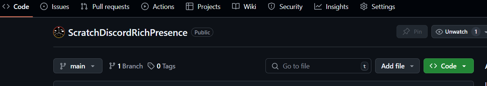
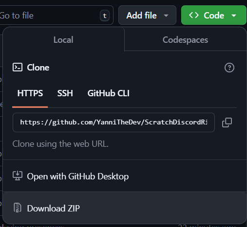
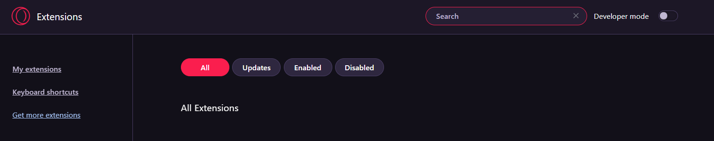

# Installation Guide

## Installing the desktop application

Head over to [this installation page](https://github.com/lolamtisch/Discord-RPC-Extension/releases/tag/0.3.0) to download the desktop application. This allows the extenstion to communicate with the server.

Donwload the **64Bit** zip file. Once downloaded, unzip the file and double click on `server_win.exe` to run it.

If you would like to run the application automatically on boot:

1. Move complete folder to an permament directory if needed.
2. Execute the `startup_windows.bat` inside the folder.
3. Press `1` and then `Enter`.
4. It should now start with the computer

#### If your computer goes into sleep mode, you will need to restart the application!

#### Other operating system installation guides are on the page!

## Installing the Discord-RPC API Extension

This browser extension allows the Scratch Discord Rich Presence extension to communicate with the server. Simply go to [here](https://chromewebstore.google.com/detail/discord-rich-presence/agnaejlkbiiggajjmnpmeheigkflbnoo) to download it.

Once it is finished, we can move onto the last step!

## Installing the Scratch Discord Rich Presence Extension

Because Google requires a $5 USD payment to be made to upload an extension to the webstore, there is absolutely no way I am paying. So to install my extension without the webstore, you will have to download this repository as a **zip** file.

To do this, click on the green `CODE` button located next to the **About** section of the repository.
|  |
| :--: |
|**_The button is located top right in the screenshot_**|

 

Once you click the button, a popup should appear. Go ahead and **Download ZIP**.
|  |
| :--: |
|**_Download ZIP button is right above this caption_**|

 

**Unzip** the folder that you have just downloaded. Double-click into the **unzipped** folder and you should be met with another folder named **ScratchDiscordRichPresence-main**.

Nice you have downloaded the repository!

Now you will have to access the extensions page of your browser. Once you are in there, **turn on developer mode**. There should be a toggle somewhere near the top. In the screenshot below, I am on the Opera GX browser.
|  |
| :--: |
|**_Toggle on the developer mode, which is located next to the search bar_**|

 
